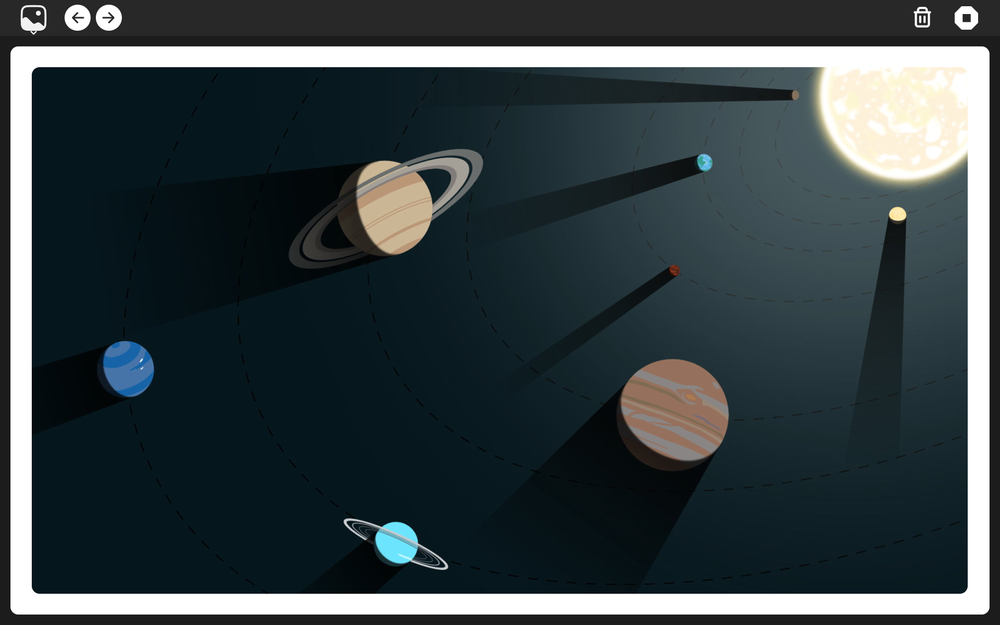

# Gallery Activity for Sugar

This is a simple gallery that pulls up media files from `~/Pictures`.\
The latest modified files are displayed first.

On the toolbar, next, previous and delete buttons are for navigation and deletion respectively

Some Keyboard Shortcuts:
- Previous Media: <kbd>Left</kbd> or <kbd>Back</kbd> key
- Next Media: <kbd>Right</kbd> or <kbd>Up</kbd> key
- Delete Media: <kbd>Delete</kbd> key 
- Play/Pause Video: <kbd>P</kbd> key

The images are displayed using `Pixbuf` and rounded corners are drawn using drawingArea and `cairo`. 

The videos use `GStreamer`

 

### Screenshot:
